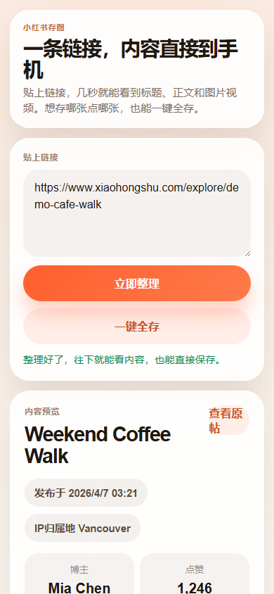
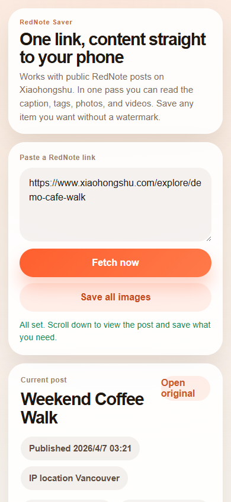
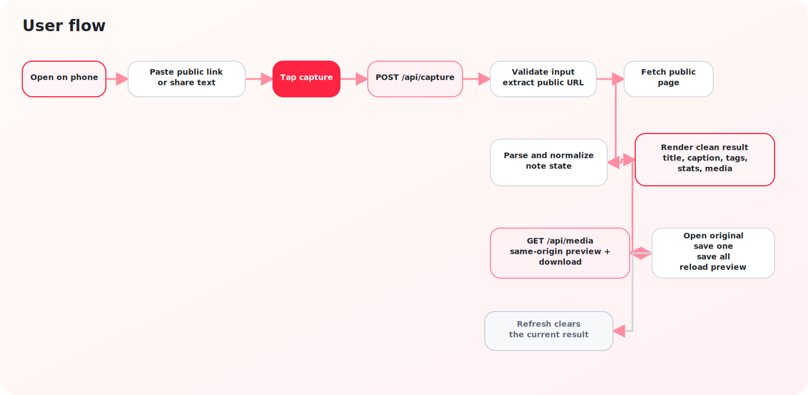
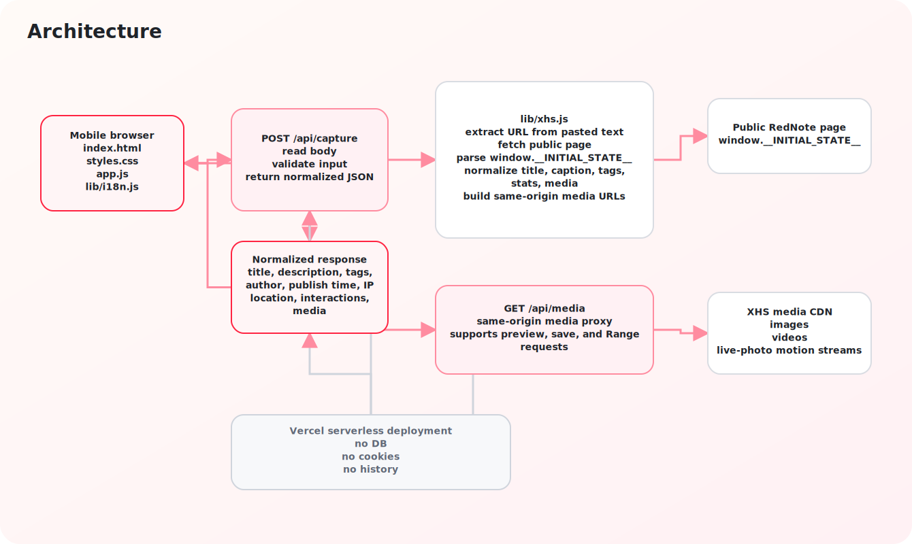

# Lightweight RedNote Scraper

[](https://github.com/hanco1/LightweightRedNoteScraper)
[](https://github.com/hanco1/LightweightRedNoteScraper/issues)
[](https://vercel-iphone-mvp.vercel.app)
[](./docs)

[English](./README.md) · [在线访问](https://vercel-iphone-mvp.vercel.app) · [用户流程](./docs/user-flow.zh-CN.md) · [架构说明](./docs/architecture.zh-CN.md)

一个轻量、面向手机访问的小红书 / RedNote 公开笔记抓取工具。贴入一条公开链接，就可以读取正文、标签、图片、视频和 Live Photo 动态资源，并直接在手机浏览器里保存需要的内容。无广告、无账号登录、无 cookies、无服务端历史记录。

## 页面预览

### 中文移动端界面



### 英文移动端界面



## 它能做什么

- 一次抓取一条公开的小红书 / RedNote 笔记
- 提取标题、正文、标签、发布时间、IP 归属地和互动数据
- 支持图片、视频和 Live Photo 动态资源
- 提供中英文双语手机网页界面
- 支持单个媒体保存，也支持一键保存全部媒体

## 为什么它很轻量

- 不需要数据库
- 不需要登录流程
- 不保存账号状态
- 不保存 cookies
- 不保留服务端历史记录
- 没有广告和厚重后台
- 围绕手机浏览器做了快速单链接流程

## 功能边界

- 仅支持公开笔记
- 不抓评论
- 不抓登录后私有数据
- 不做服务端永久存储
- 托管版不提供本地文件夹选择器

## 工作流程

1. 粘贴一条公开的小红书 / RedNote 链接，或者分享文案。
2. 页面将输入发送到 `POST /api/capture`。
3. 服务端请求公开页面并提取 `window.__INITIAL_STATE__`。
4. 结果被整理成统一结构，返回标题、正文、标签、互动数据和媒体列表。
5. 图片与视频通过同域 `/api/media` 代理进行预览与下载。

## 技术栈

- 前端：原生 HTML、CSS、JavaScript
- 接口：Vercel Node.js Functions
- 解析：Node.js + `vm` 读取公开页面状态
- 媒体传输：同域代理接口 `/api/media`
- 测试：Node 内置测试运行器
- 部署：Vercel

## 目录结构

```text
.
├─ api/
│  ├─ capture.js
│  └─ media.js
├─ docs/
│  ├─ architecture.md
│  ├─ architecture.zh-CN.md
│  ├─ user-flow.md
│  ├─ user-flow.zh-CN.md
│  ├─ images/
│  └─ diagrams/
├─ iphone/
│  └─ index.html
├─ lib/
│  ├─ i18n.js
│  └─ xhs.js
├─ tests/
│  ├─ i18n.test.js
│  ├─ media.test.js
│  └─ xhs.test.js
├─ app.js
├─ dev-server.mjs
├─ index.html
├─ styles.css
└─ vercel.json
```

## 本地运行

要求：

- Node.js 20+

```bash
npm install
npm test
npm run dev
```

默认本地地址：

- `http://127.0.0.1:3015`

## 部署到 Vercel

```bash
vercel
vercel --prod
```

## 文档

### 图示预览

#### 用户流程图



#### 架构图



- 英文 README：[`README.md`](./README.md)
- 用户流程（英文）：[`docs/user-flow.md`](./docs/user-flow.md)
- 用户流程（中文）：[`docs/user-flow.zh-CN.md`](./docs/user-flow.zh-CN.md)
- 架构说明（英文）：[`docs/architecture.md`](./docs/architecture.md)
- 架构说明（中文）：[`docs/architecture.zh-CN.md`](./docs/architecture.zh-CN.md)
- 用户流程图：[`docs/diagrams/user-flow.drawio`](./docs/diagrams/user-flow.drawio)
- 渲染后的用户流程图：[`docs/diagrams/user-flow.svg`](./docs/diagrams/user-flow.svg)
- 架构图：[`docs/diagrams/architecture.drawio`](./docs/diagrams/architecture.drawio)
- 渲染后的架构图：[`docs/diagrams/architecture.svg`](./docs/diagrams/architecture.svg)

## 免责声明

内容版权归平台及原作者所有。  
本项目不保存账号 cookies，也不会在服务端永久存储抓取到的内容。
